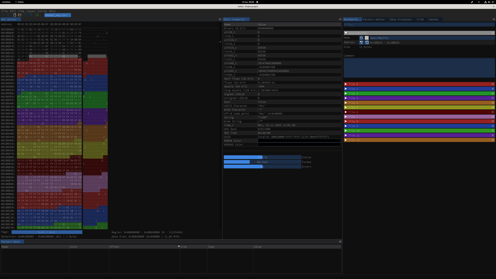
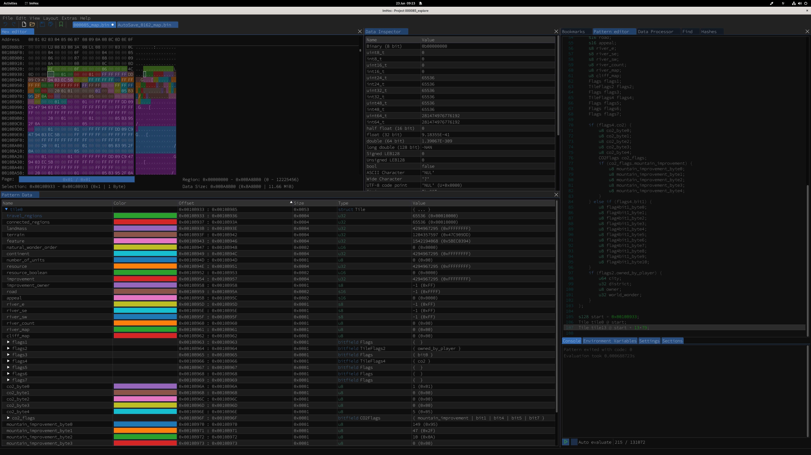
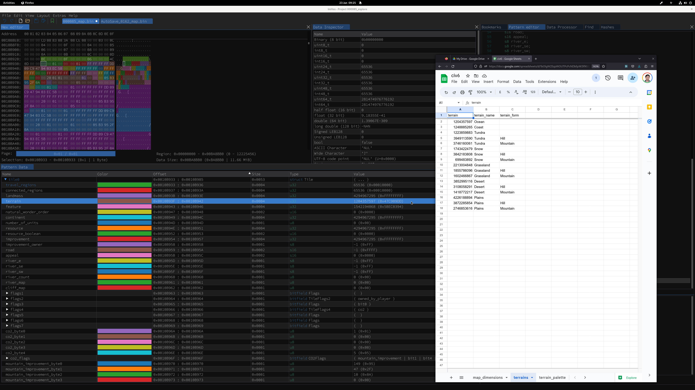

# civ6save analysis

## Setup

Install [ImHex](https://imhex.werwolv.net/).

## Dump decompressed binary file

I use the `dump_decompressed` component from the `civ6_pipeline` to produce the decompressed binary data file.

```bash
viash run ../civ6_pipeline/src/civ6_save_renderer/dump_decompressed/config.vsh.yaml -- \
  --input saves/000085.Civ6Save \
  --output saves/000085_map.bin
```

## Open project in ImHex

When opening the decompressed binary file in ImHex, the first thing to do is search for the array
`0E 00 00 00 0F 00 00 00 06 00 00 00`. In the civ6_pipeline, this is called the "SearchBuffer".

At SearchBuffer + 0x10, the first tile of the map is found. I added bookmarks to the ImHex project
to be able to easily distinguish the first couple of tiles. At the edge of the map, these tiles typically
begin with `00 00 01 00 00 01 00 00`.



## Variable tile length

The reason for the tearing observed in [viash-io/civ6_pipeline#9](https://github.com/viash-io/civ6_pipeline/issues/9)
is because the tile information is variable in length. Up until now, I came across tiles that are 55, 72, 79, 96, 99, or 116 in length.

* Standard tile information: 55 bytes
* If the tile affects CO2 in some way: +24 bytes
  - In addition, if the tile is a ski resort or tunnel: +20 bytes
* When the flag next to the CO2 is set (I don't know the meaning of this flag yet): +44 bytes
* If the tile is owned by a player: +17 bytes

## Hex pattern

I'm trying to create a hex pattern with ImHex to be able to make sense of the Civ6Save file more easily. By loading it into the Pattern Editor and evaluating the code in the Console, you can explore the tile information quite easily.



## Pattern Data

Note that the values observed in the Pattern Data should match up with the values in the [Civ6Save Data Sheet](https://docs.google.com/spreadsheets/d/1bOlgW25zpWOUTPcPcNDbfpXK5f90J2BBaBuzwypABQs/edit) document.



