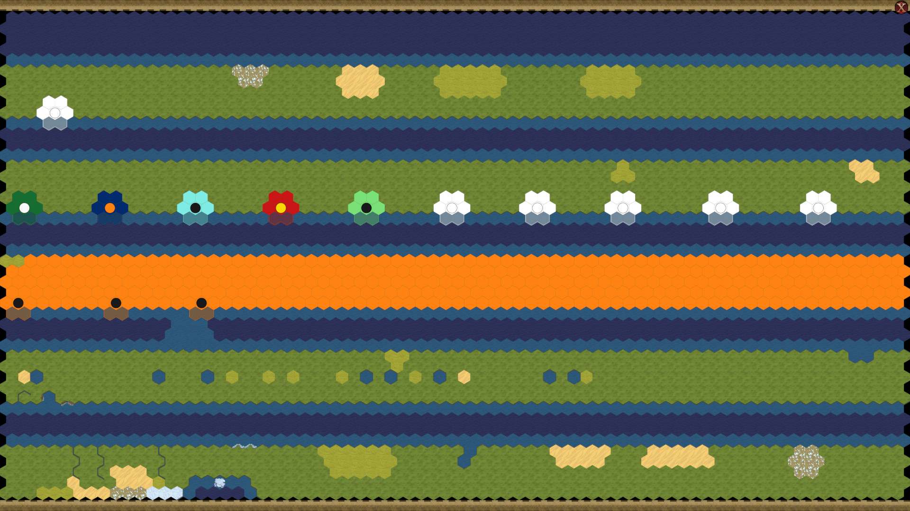

# TestMap

A map for decyphering the Civ6Save format. Location of Civ6 files:

* Civ6Save: `$STEAM_LIBRARY/steamapps/compatdata/289070/pfx/drive_c/users/steamuser/Documents/My Games/Sid Meier's Civilization VI/Saves/Single`.
* Civ6Map: `$STEAM_LIBRARY/steamapps/compatdata/289070/pfx/drive_c/users/steamuser/Documents/My Games/Sid Meier's Civilization VI/Saves/WorldBuilder`.



- All terrains (tiles 0 - 16)
- All features (tiles 74 - 94)
- All continents (tiles 296 - 338)
- Most improvements (tiles 1481 - 1539, all except barbarian outpost)
- All resources (tiles 815 - 862)
- All world wonders (scattered throughout the map)
- All roads (tiles 1633 - 1642)
- All units (tiles 2813 - 2955)
- 10 players, 1 city state (Brussels), 12 cities
- Multiple districts
- Feature rotations (tiles 2295 - 2301)
- Coastal height (tiles 2306 - 2309)
- Resource counts (tiles 963 - 966)
- Different river orientations (see sheet)
- Different cliff orientations (see sheet)

Specific player properties:
- America (Player 0) has all tiles revealed
- Arabia (Player 1) has access to all civics
- Australia (Player 2) has access to all techs
- Aztec (Player 3) has 123465+x gold
- Babylon (Player 4) has 456789+x faith

```bash
viash run ../civ6_pipeline/src/civ6_save_renderer/dump_decompressed/config.vsh.yaml -- \
  --input "testmap/testmap_v0.2.Civ6Save" \
  --output "testmap/testmap_v0.2.bin"
```

For tile locations of specific terrains, features, etc, check the "testmap_tile" column in the [Civ6Save Data Sheet](https://docs.google.com/spreadsheets/d/1bOlgW25zpWOUTPcPcNDbfpXK5f90J2BBaBuzwypABQs/edit#gid=66860690)